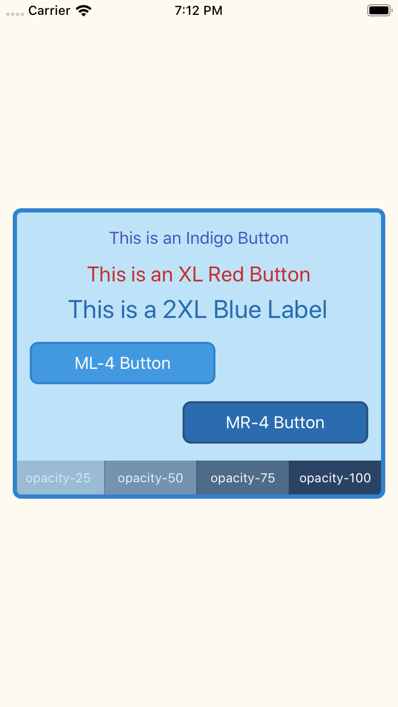

# tailwind-tss-color-generator

## Disclaimer
This is my first attempt at creating this utility. For now it has a small set of styles.

I will gradually add more styles and try to match them as close as possible to Titanium's properties.

## What is this utility
In case you need ( or want ) to use [tailwind's framework](https://tailwindcss.com/) in your Titanium App, you can use this small converter to generate an app.tss file with the following styles:

## Layout
- ### Top / Right / Bottom / Left
	- For any element that uses the 'top', 'right', 'bottom', 'left' properties.

## Typography
- ### Font Size
	- For any element that uses the 'fontSize' property.

- ### Text Align
	- For any element that uses the 'textAlign' property.

- ### Text Color
	- For any element that uses the 'color' property.

## Backgrounds
- ### Background Color
	- For any element that uses the 'backgroundColor' property.

## Borders
- ### Border Color
	- For any element that uses the 'borderColor' property.

- ### Border Width
	- For any element that uses the 'borderWidth' property.

- ### Border Radius
	- For any element that uses the 'borderRadius' property.

## Spacing
- ### Margin
	- For any element that uses the 'top', 'right', 'bottom', 'left' properties.

## Sizing
- ### Width
	- For any element that uses the 'width' property.

- ### Height
	- For any element that uses the 'height' property.

## Effects
- ### Opacity
	- For any element that uses the 'opacity' property.

## Instalation
Copy [app.tss](https://github.com/macCesar/tailwind-tss-color-generator/blob/master/app.tss) to `/app/styles` directory, or add the contents manually.

The provided `app.tss` is what the script generates. You can also compile it locally yourself.

### Or you can compile it locally

1. Download or clone this repository to your machine.

2. Unzip and cd into the directory

3. Install node modules with [npm](https://docs.npmjs.com/getting-started/what-is-npm)
```bash
npm install
```

4. run the start script
```bash
npm start
```

5. The main script will generate a new app.tss file.

6. Copy the content of that file into your proyect's app.tss file.

## Usage
```xml
<Alloy>
    <Window class="bg-orange-100">
        <View class="mx-3 bg-blue-200 border-blue-600 rounded-lg border-4" height="Ti.UI.SIZE">
            <View layout="vertical" height="Ti.UI.SIZE">

                <Button class="mt-3 text-indigo-700 text-base">This is an Indigo Button</Button>

                <Button class="text-red-700 text-xl">This is an XL Red Button</Button>

                <Label class="text-blue-700 text-2xl">This is a 2XL Blue Label</Label>

                <Button class="w-1/2 h-10 mt-4 ml-4 border-blue-600 border-2 bg-blue-500 text-base text-white rounded-lg">ML-4 Button</Button>

                <Button class="w-1/2 h-10 mt-4 mr-4 border-blue-800 border-2 bg-blue-700 text-base text-white rounded-lg">MR-4 Button</Button>

                <View class="mt-4 mb-1 h-auto" layout="horizontal">
                    <Label class="w-1/4 h-8 text-xs text-white text-center bg-blue-900 opacity-25">opacity-25</Label>
                    <Label class="w-1/4 h-8 text-xs text-white text-center bg-blue-900 opacity-50">opacity-50</Label>
                    <Label class="w-1/4 h-8 text-xs text-white text-center bg-blue-900 opacity-75">opacity-75</Label>
                    <Label class="w-1/4 h-8 text-xs text-white text-center bg-blue-900 opacity-100">opacity-100</Label>
                </View>
            </View>
        </View>
    </Window>
</Alloy>
```

## iOS Example


## TODO
I'll try to convert more properties.
