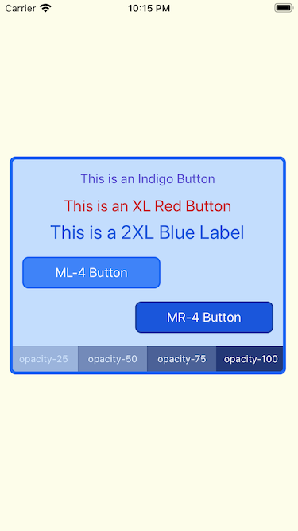
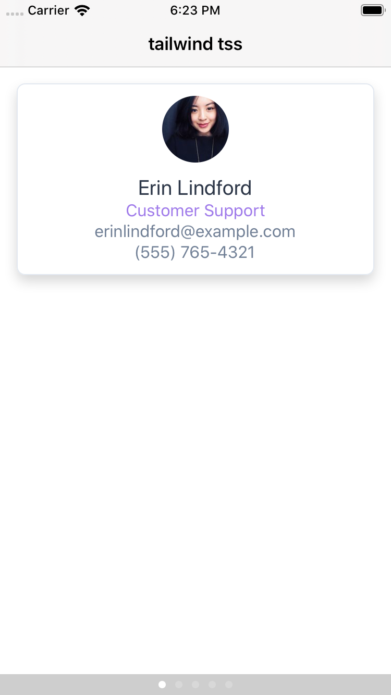
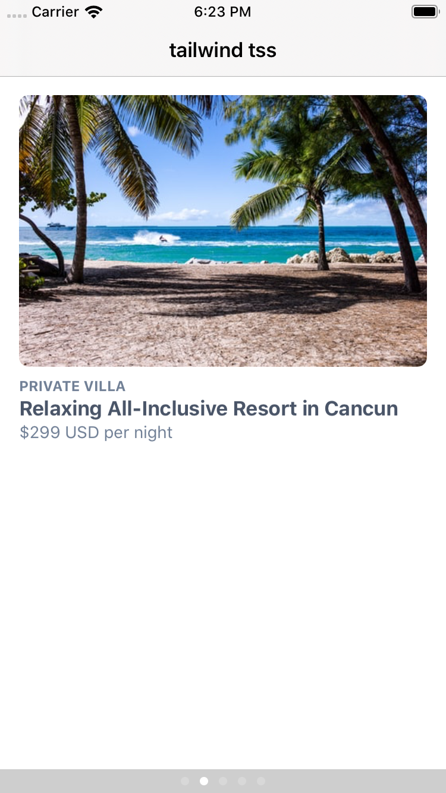
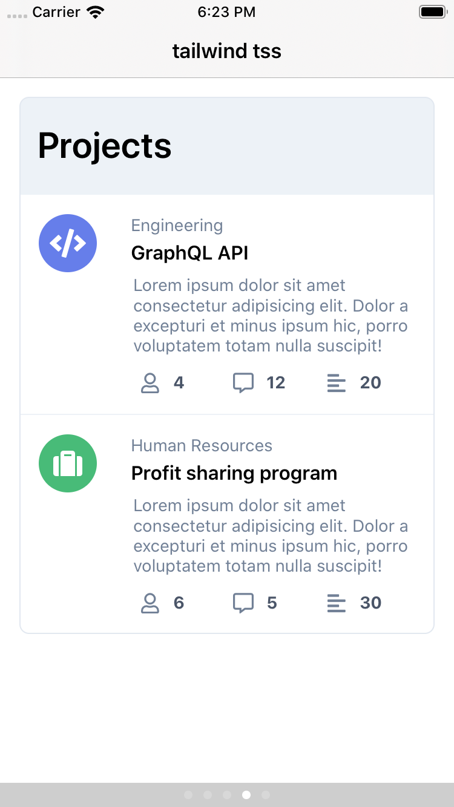
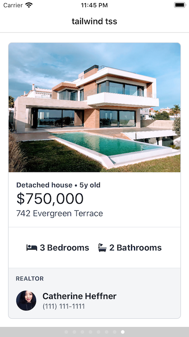

# tailwind-tss-color-generator

## Disclaimer
This is my first attempt at creating this utility. For now it has a small set of styles.

I will gradually add more styles and try to match them as close as possible to Titanium's properties.

## What is this utility?
In case you need ( or want ) to use [Tailwind CSS](https://tailwindcss.com/) in your [Titanium App](https://www.appcelerator.com/mobile-app-development-products/), you can use this small converter to generate an app.tss file with the following styles:

## Layout
- ### Top / Right / Bottom / Left
	> For any element that uses the `'top'`, `'right'`, `'bottom'` and `'left'` properties.

## Typography
- ### Font Size
	> For any element that uses the `'fontSize'` property.

- ### Font Style
	> For any element that uses the `'fontStyle'` property.

- ### Font Weight
	> For any element that uses the `'fontWeight'` property.

- ### Placeholder Color
	> For any element that uses the `'hintTextColor'` property.

- ### Text Align
	> For any element that uses the `'textAlign'` property.

- ### Text Color
	> For any element that uses the `'color'` property.

- ### Vertical Align
	> For any element that uses the `'verticalAlign'` property.

## Backgrounds
- ### Background Color
	> For any element that uses the `'backgroundColor'` property.

## Borders
- ### Border Color
	> For any element that uses the `'borderColor'` property.

- ### Border Width
	> For any element that uses the `'borderWidth'` property.

- ### Border Radius
	> For any element that uses the `'borderRadius'` property.

## Spacing
- ### Padding
	> For any element that uses the `'padding'` property.

- ### Margin
	> For any element that uses the `'top'`, `'right'`, `'bottom'`, `'left'` properties.

## Sizing
- ### Width
	> For any element that uses the `'width'` property.

- ### Height
	> For any element that uses the `'height'` property.

## Effects
- ### Box Shadow
	> For any element that uses the `'viewShadowOffset'`, `'viewShadowRadius'` and `'viewShadowColor'` properties.

- ### Opacity
	> For any element that uses the `'opacity'` property.

## Instalation
Copy the necessary files from `/app` folder to your `/app` folder.

The provided `/app/styles/tailwind.tss` is what the script generates. You can also compile it locally yourself.

### Or you can compile it locally

1. Download or clone this repository to your machine.

2. Unzip and cd into the directory

3. Install node modules with [npm](https://docs.npmjs.com/getting-started/what-is-npm)
```bash
npm install
```

4. run the script
```bash
npm run tailwind-tss
```

5. The main script will generate a new `tailwind.tss` file.

6. Copy the content of that file into your proyect's `app.tss` file.

## Usage
```xml
<Alloy>
    <Window class="bg-orange-100">
        <View class="h-auto mx-3 bg-blue-200 border-4 border-blue-600 rounded-lg">
            <View class="h-auto" layout="vertical">

                <Button class="mt-3 text-base text-indigo-700">This is an Indigo Button</Button>

                <Button class="text-xl text-red-700">This is an XL Red Button</Button>

                <Label class="text-2xl text-blue-700">This is a 2XL Blue Label</Label>

                <Button class="w-1/2 h-10 mt-4 ml-4 text-base text-white bg-blue-500 border-2 border-blue-600 rounded-lg">ML-4 Button</Button>

                <Button class="w-1/2 h-10 mt-4 mr-4 text-base text-white bg-blue-700 border-2 border-blue-800 rounded-lg">MR-4 Button</Button>

                <View class="h-auto mt-4 mb-1" layout="horizontal">
                    <Label class="w-1/4 h-8 text-xs text-center text-white bg-blue-900 opacity-25">opacity-25</Label>
                    <Label class="w-1/4 h-8 text-xs text-center text-white bg-blue-900 opacity-50">opacity-50</Label>
                    <Label class="w-1/4 h-8 text-xs text-center text-white bg-blue-900 opacity-75">opacity-75</Label>
                    <Label class="w-1/4 h-8 text-xs text-center text-white bg-blue-900 opacity-100">opacity-100</Label>
                </View>
            </View>
        </View>
    </Window>
</Alloy>
```

## iOS Example


## More Examples
These examples are from the accompanying [Titanium App](https://github.com/macCesar/tailwind.tss-sample-app), created to showcase all the styles from the generated [app.tss](https://github.com/macCesar/tailwind-tss-color-generator/blob/master/app.tss) file.










## TODO
I'll try to convert more properties.
